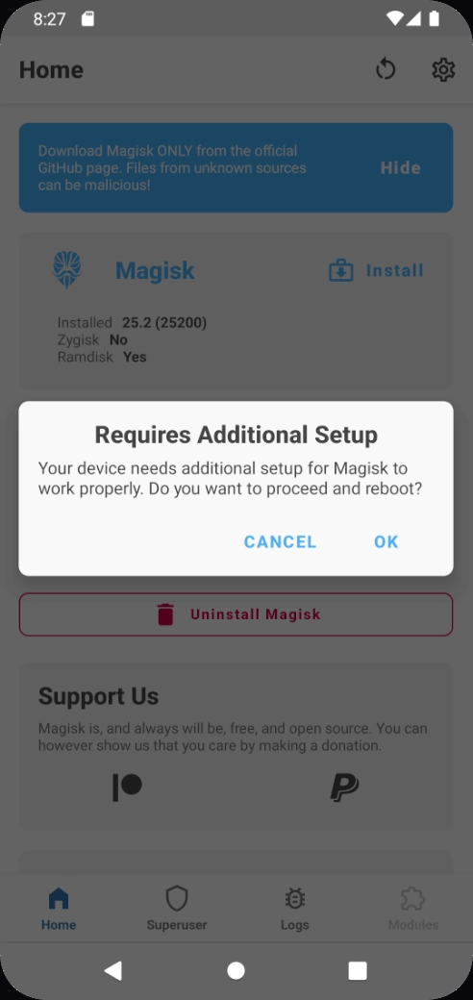

# Root AVD

[https://github.com/newbit1/rootAVD](https://github.com/newbit1/rootAVD)

Ke direktori rootAVD

```jsx
┌──(rehan㉿Access)-[D:/cybersec/tools/mobile/rootAVD]-[master]
└─$ .\\rootAVD.bat ListAllAVDs
```

Cari yang Android 31 (sesuaikan)

```shellscript
┌──(rehan㉿Access)-[D:/cybersec/tools/mobile/rootAVD]-[master]
└─$ ./rootAVD.bat system-images\\android-31\\google_apis_playstore\\x86_64\\ramdisk.img
```

Setelah proses selesai. Pilih app Magisk

<figure><figcaption></figcaption></figure>

Klik OK, AVD akan melakukan reboot. Setelah itu cek apakah proses rooting berhasil
